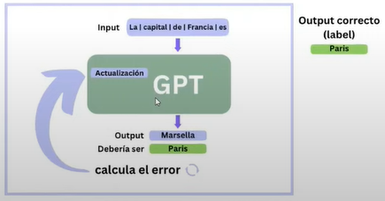

# Curso: Inteligencia Artificial Generativa: Fundamentos y Proyectos Prácticos

Curso dado por **Carlos Acosta Parra** desde la UNCa en el espacio del NODO Tecnologico de Catamarca  

Que tipo groso este carlitos

---

Utils
- [Estructura del Curso 📄](https://docs.google.com/document/d/1_07yl2PCgoVNJg9OcsBwn9sBl7lybAagt8SB0hICZXs/edit?tab=t.0)
- [Todas las clases 📄](https://docs.google.com/document/d/1BY0asGvFUmnIFQ2x7qpsk-s5T_ZkYxqSavh8ck_61Bc/edit?usp=sharing)
- [Comunidad wsp](https://chat.whatsapp.com/G3p7VWk189kAXM8r3hnvfT)
---
# 🌙 CLASE 01
_Mier 23/10/24_

### Obejtivo
- Incapie en la práctica y la aplucación den .env habitual

### Proyecto final
- Ir pensando en qué lo puedo utilizar  
- Empezar depsues de la mitad del curso

## Maquinas programables y que aprenden
- EX: Calculadora -> se le da una "sentencia", o sea, es codigo, es `programacion`

## QUE IMPLICA QUE UNA MAQUINA APRENDA?
- EX: [teachable machine](https://teachablemachine.withgoogle.com/)   
  
en vez de agregarle `sentencias` pongo examples (directorio de fotos / videos)
- Aprenden de datos
  - Ex -> **netflix ->** personalizavion - adaptatiblidad dinamica - automatizacion de sugerencias  

## Avances de la IA
- no es un concepto nuevo
- toma apogeo en los 50s
- por que se habla tan masivamente ahora?
  - se puede acceder a grandes volumenes de datos
    - para realizar los entrenamientos
    - antes no era accesible
    - ex: wikipedia
  - Avance de la tecnologia
    - mas accesible
    - alquiler de computos
  - chatGPT es un example de `DEMOCRATIZACION` de la IA
    - si no fuera por chat gpt seguiría siendo un nicho de .env tecnologico
    - VAMOOOO GPT COMPAÑEROOOO ✌✌✌

## CAMBIO DE PARADIGMA - LIBRO > GOOGLE > CHATGPT
`Google ->` "intuye" que las palabras claves estan en el "listado" de paginas que nos da, supone que tal pagina nos sirve, y nosotros nos tomatos el trabajo de entrar a cada pagina.  
`ChatGPR ->` usa **LENGUAJE NATURAL** -> nos "entiende" -> "procesa" una respuesta y la da, como si fuera un experto del tema

## BUSQUEDA DE INFORMACION ... ?
no dijo nada charly jaja

## IA GENERATIVA
**ANTES** se entranaba algoritmos para tareas especificas *ex -> prediccion meteorologica*  
**AHORA** la `IA GENERATIVA` puede generar :p

`EX`
- si cargo las temperaturas de los ultimos 50 años de catamarca me va a decir cuanto va a hacer mañana, o sea `PREDICE`
- GENERA - EMULA
- la `IA GEN` emula nuestro cerebro
  - si hacemos el clima se neceita mucha info y solo lo usaria la gente meteorologica

## APLICACIONES Y MODELOS
> ChatGPT es la **APP** que consulta al **MODELO** *LAMA 3od*

**Aleoría del auto 🚗**  
modelo -> motor  
app -> Chasis carroeceria

"Hay un nicho para todo"
"Se vienen las apps/programas que van a consultar a modelos de IA"

## CARRERA DE IAs
Los dueños de toda la infraestructura de IA
| OpenIA | vs | Anthropic | vs | Google |
| --- | :---: | --- | :---: | --- |
| Microsoft (inversor) | - | Amazon (inversor) | - | Google 😑 |
| GPT-4 | - | Claude 3.5 Sonnet | - | Gemini 1.5 Flash |
| [ChatGPT](https://chatgpt.com/) | - | [Claude](https://claude.ai/new) | - | [Gemini](https://gemini.google.com/app) |

_vale la aclaración de que esta clase fue transcripta con total tranquilidad a partir de mis apuntos escrutos en papel, veremos que pasa en la clase 2 en la que voy a tomar notas en vivo_

---
# 🌙 CLASE 02
_30/10/24_

> Vamos a trabajar con IAs tipo chat

## INTERACCIONES TIPO TEXTO
``Perplexity`` esta hecha para buscar informacion e indagar  
tambien muestra la bibliogtafía y da sugerencias sobre la tematica  
[Perplexity](https://www.perplexity.ai/)

## LLM Large Language Models
- GRANDES MODELOS DE LENGAJES
- Lenguajes de modelos de grande escala  
- estan entrenado con grandes volumenes de datos  
- saben sobre todo
- hacen
  - consultas
  - redactar textos
  - ver pdf

## PROMPS
- son las instrucciones que les damos a un ``LLM`` 
- un buen pompot incluye
  - info relevante
  - estructura adecuada
- la calidad del pompt tiene impato en la respuesta

> depende de la calidad y cantidad de datos que se le brinda al **LLM** y la calidad del **prompt**

---

### ChatGPT Gratuito

### EX chatGPT para ayudar con mails

### GPT PLUS (2023) o sea, ya habilitaron esto para free

### Conceptos (viejo)
``parametros`` -> cantidad de valores o puntos de referencia para darnos una rta
ex -> si quiero prediccion meteorologica par amañana  
parametros: temperatura actual - humedad - viento - etc  
lo cual lo hace mas preciso

antes declaraban cuanto tenian 2022 -> 120 o 160 millones de modelos  
hoy en dia no declaran pero dicen que tiene 10 veces mas  
o dividen entre modelos por ej 4 modelos de 300 millones  
o un solo modelo de BIlloens

100millones de usd para entrenar gpt-4 pero ya no declaran 

SE LE PUEDE AGREGAR UN MODELO A UN MODELO YA PRE ENTRENADO
se le "agrega" capas propias

GPTs -> asistentes

## Tokenizacion
- porcien de texto  
- unidades que ulilizan los modelos para trabajar

- nos cobran por los token que procesn y otro monto es lo que nos devuelven

## Alucinaciones
- sepan o no, el modelo responde
- puede responder cualquier cosa, o en nichos quizas no sirva
- ex -> para abogados quizas no esta entrenado con leyes recientes
- alucinacion -> respuesta no correcta

## Ventana de contexto
- capacidad del modelo apr recordar lo que tiene en la conversacion
- gemini tiene una ventana de contexti de 1millon de tokens
  - 750mil palabras de una conversacion
- el resto tiene unas 250.000 tokens es decir 200 paginas

> la ventana de contect ocupa lo que entra y lo que sale, o sea, si le meto la biblia ya lleno la ventana de contexto

chat gpt lo llama ``memoria``, usa parte de la ventan de contecto para esto

_bueno... algo aslió_

---
# 🌙 CLASE 03
_06/11/24_

